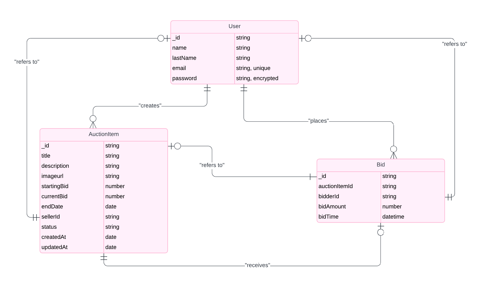

# Database Schema and Design Decisions

**Database Used**: NoSQL (MongoDB)
### Database Schemas/ Data Models 

### User Schema

- **Fields:**
  - `name`: First name of the user. *(String)*
  - `lname`: Last name of the user. *(String)*
  - `email`: User's email, must be unique. *(String)*
  - `password`: User's hashed password. *(String)*

### Auction Item Schema

- **Fields:**
  - `title`: Title of the auction item. *(String)*
  - `description`: Description of the auction item. *(String)*
  - `image`: Image URL of the auction item. *(String)*
  - `minBid`: Minimum bid amount. *(Number)*
  - `currentBid`: Current highest bid amount. *(Number)*
  - `endDate`: Auction end date and time. *(Date)*
  - `sellerId`: Reference to the user who created the auction. *(ObjectId, ref: 'users')*
  - `status`: Status of the auction (`active`, `completed`, `canceled`). *(String, default: 'active')*
  - `createdAt`: Timestamp of auction creation. *(Date, default: Date.now)*
  - `updatedAt`: Timestamp of the last update. *(Date, default: Date.now)*

### Bid Schema

- **Fields:**
  - `auctionItemId`: Reference to the auction item. *(ObjectId, ref: 'auctions')*
  - `bidderId`: Reference to the user who placed the bid. *(ObjectId, ref: 'users')*
  - `bidAmount`: Amount of the bid. *(Number)*
  - `bidTime`: Timestamp of when the bid was placed. *(Date, default: Date.now)*

### Design Decisions
1. **User Authentication**: User authentication is via email and password. Passwords are hashed using bcrypt before being stored in the database.
2. **Auction Lifecycle**: Each auction item has a lifecycle managed by the `status` field, which can be `active`, `completed`, or `canceled`. Auctions are created with a default status of `active`.
3. **Bid Placement**: Bids can only be placed on active auctions and must be higher than the current highest bid. Each bid updates the `currentBid` of the auction item.
4. **User-Specific Data**: Users can view their own auctions and bids by querying the database using their unique user ID. This helps in personalizing the user experience.
5. **Data Relationships**: Schemas are connected using MongoDB references (ObjectId) to establish relationships between users, auctions, and bids. This ensures data integrity and efficient querying.
